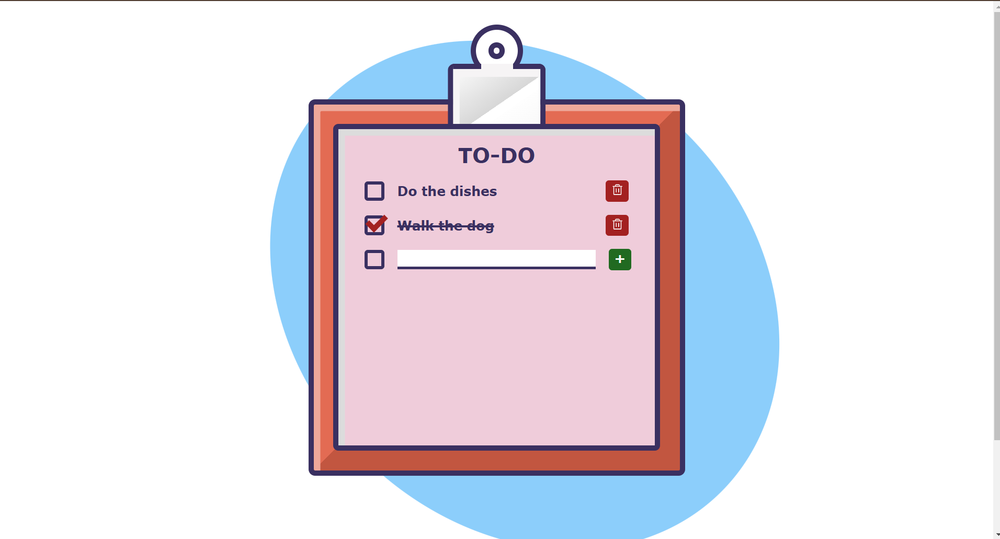

# Euphoria🎯
## Our project is a web app designed to help students manage stress and boost productivity. It combines tools like a timer, to-do list, and diary with relaxation features such as breathing exercises and motivational quotes. Fun games like Flappy Bird and Hangman ensure enjoyable breaks, promoting focus and balance
### Team Name: Techcess
### Team Members
- Member 1: OneelaGopi - LBS College of Engineering, kasargod.
- Member 2: Yadumithra U N - LBS College of Engineering, Kasargod.
- Member 3: Thanseeha Nasrin P M  - LBS College of Engineering, Kasargod.
### Hosted Project Link
https://yadumitra.github.io/euphoria/
### Project Description
Our project is a web app designed to help students reduce stress and enhance productivity while studying. It includes features like a timer, to-do list, diary, breathing exercises, motivational quotes, and games like Flappy Bird and Hangman. The app promotes focus, balance, and enjoyable study breaks.
### The Problem statement
Students often struggle with managing stress caused by overwhelming workloads, which affects their ability to maintain focus and productivity. The pressure to meet academic demands can lead to burnout, especially when effective stress-relief tools are unavailable. There is a need for a solution that seamlessly integrates productivity and relaxation techniques into students’ study routines to help them achieve balance and efficiency.
### The Solution
Our solution is a web app designed to help students manage stress and enhance productivity through a combination of effective tools and engaging features. The app includes a timer, to-do list, and diary to organize tasks and track progress, while offering relaxation options like breathing exercises and motivational quotes to promote mental well-being. Additionally, fun games such as Flappy Bird and Hangman provide refreshing study breaks, creating a balanced approach to academic success. By integrating productivity, relaxation, and entertainment in one platform, the app empowers students to focus better, reduce stress, and achieve their goals efficiently.
## Technical Details
### Technologies/Components Used
For Software:
- [html,css,javascript.]
- [Axios (for HTTP requests)
Chart.js / D3.js (for data visualization)
Framer Motion (for animations)
Lodash (utility functions)
Tailwind CSS (CSS framework)]
- [Tools used]
For Hardware:
-None.
### Implementation
For Software:

### Project Documentation
For Software:
# Screenshots (Add at least 3)

*Opening fade out animation of our website.*

*Home page*
!
*To-do list*
!
*Diaryy/personal journal*
!

# Diagrams 

*Add caption explaining your workflow*
For Hardware:
none
# Build Photos
!our team
!none
*List out all components shown*

*Explain the build steps*

*Explain the final build*
### Project Demo
# Video
[euphoria\img\our app.mp4]
*The video demonstrates the whole website of ours from the home to each sections*
# Additional Demos
none
## Team Contributions
- Yadumithra U N: coding, design, and documentation.
- Oneela Gopi: coding, design and documentation.
- Thanseeha Nasrin: coding,design, idea implementation
---
Made with ❤️ at TinkerHub
